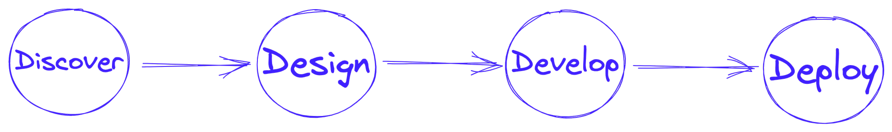
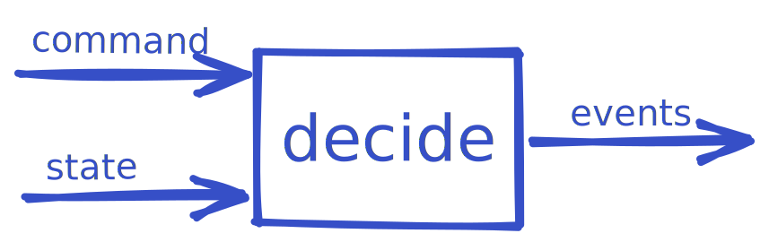
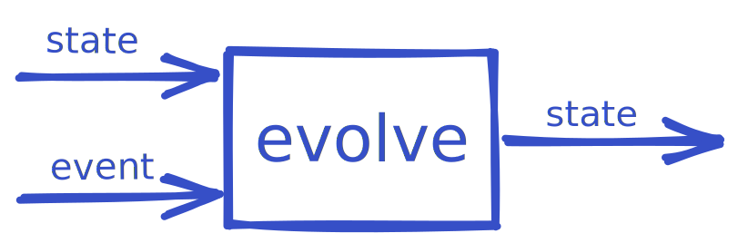
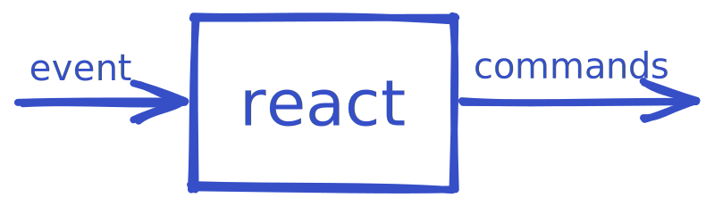

## [fraktalio.com](https://fraktalio.com/) | [blog](https://fraktalio.com/blog/) | [domain modeling](https://fraktalio.com/domain-modeling) | [playground](https://fraktalio.com/blog/playground)

We help organizations improve how they design, develop and deliver software.

## Domain modeling

[Domain modeling](https://fraktalio.com/domain-modeling) is a powerful tool for clarifying and refining our understanding of a subject area, and for identifying opportunities for optimization and improvement. By carefully considering the needs of stakeholders and the nature of the domain, it is possible to create effective and useful models that can facilitate communication and drive progress.

---

### f {model}

#### [fmodel-kotlin](https://github.com/fraktalio/fmodel) | [fmodel-ts](https://github.com/fraktalio/fmodel-ts) | [fmodel-rust](https://github.com/fraktalio/fmodel-rust) | [fmodel-java](https://github.com/fraktalio/fmodel-java)

FModel is a set of libraries that aims to bring functional, algebraic, and reactive domain modeling to Kotlin / TypeScript / Rust / Java. It is inspired by DDD, EventSourcing, and Functional programming communities.

💙 Accelerate the development of compositional, ergonomic, data-driven, and safe applications 💙

| Command      | Event         | State         |
| :---         |     :---:     |          ---: |
| An intent to change the state of the system | The state change itself, a fact. It represents a decision that has already happened | The current state of the system. It has evolved out of past events |
|  |  |  |
| -       | -         | -         |
| Decide       | Evolve         | React         |
| A pure function that takes command and current state as parameters, and returns the flow of new events | A pure function that takes event and current state as parameters, and returns the new state of the system | A pure function that takes event as parameter, and returns the flow of commands, deciding what to execute next |
|  |  |  |

#### FModel Demo Applications
|        | Event-Sourced  | State-Stored   |
| :---   |     :---:      |     :---:      |
| `Kotlin` (Spring) |  [fmodel-spring-demo](https://github.com/fraktalio/fmodel-spring-demo) | [fmodel-spring-state-stored-demo](https://github.com/fraktalio/fmodel-spring-state-stored-demo) |
| `Kotlin`(Ktor)   |  [fmodel-ktor-demo](https://github.com/fraktalio/fmodel-ktor-demo)     |    todo     |
| `TypeScript`     |  [fmodel-gift-card-ts](https://github.com/axoniq/giftcard-demo-ts)     |    todo     |
| `Rust`           |  [fmodel-rust-demo](https://github.com/fraktalio/fmodel-rust-demo), [fmodel-gift-card-rust](https://github.com/AxonIQ/axon-rust/tree/main/gift-card-rust)     |    todo     |

### f (store)

A [`Postgres` powered platform](https://github.com/fraktalio/fstore-sql) for efficiently prototyping event-sourcing and event-streaming with a minimal footprint.

💙 Ideal for startups and scaleups. 💙

---

### Axon Framework

[Axon Framework](https://www.axoniq.io/axoniq-products) reduces the toil of creating event-based applications, simplifies your code, and boosts your developer productivity. It is open source with integrations for multiple messaging and database systems, including [Axon Server](https://www.axoniq.io/products/axon-server).

Are you ready to take your business to new heights? At [Fraktalio](https://fraktalio.com/), we specialize in harnessing the power of Axon Framework to supercharge your company's growth, efficiency, and innovation.

#### Axon services

- *Consultation*: Our experts analyze your business needs, assess the potential of Axon, and provide a tailored roadmap for implementation.
- *Implementation*: We guide you through every step of Axon integration, from design and development to testing and deployment.
- *Training*: Empower your team with hands-on workshops and training sessions, ensuring they're equipped to maximize the benefits of Axon Framework.

#### Axon Demo Applications

The systems landscape consists of three
systems:
- [order management](https://github.com/fraktalio/order-demo),
- [restaurant management](https://github.com/fraktalio/restaurant-demo) and
- [courier management](https://github.com/fraktalio/courier-demo)

*Customers use the web application to place food orders at local restaurants. Application(s) coordinates a
restaurant/kitchen order preparation and a network of couriers who deliver the orders.*

---
Excited to launch your next IT project with us? Let's get started! Reach out to our team at info@fraktalio.com to begin the journey to success.
